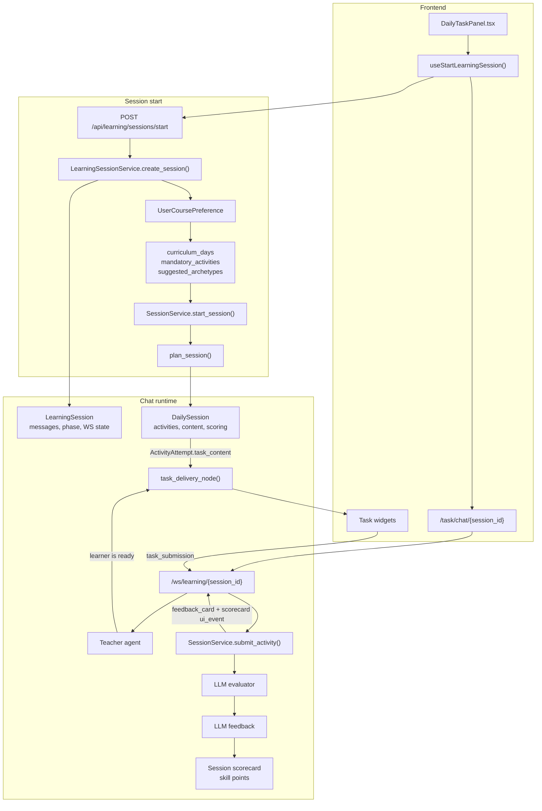

# Chat Session Runtime Template

Use this template when working on chat-session runtime behavior: starting or
resuming a session, teaching turns, WebSocket events, task delivery inside
chat, task submission, feedback, next-activity flow, or completion.

This is not a content-authoring template. Chat sessions are the runtime layer
around the daily-session system; they do not need a separate per-day authoring
workflow.

## 1. Scope

Use this guide for changes that affect:

- Dashboard start/resume behavior for today's session.
- The chat envelope layered over a V2 daily session.
- WebSocket message handling and streamed teacher responses.
- Delivery of generated task widgets inside chat.
- Submission, evaluation, feedback cards, follow-up actions, and completion.
- Scorecard retrieval from the chat page.

Do not treat a chat session as its own curriculum object. The daily-session
system owns activity planning and generated task content; the chat layer owns
the learner conversation around that content.

## 2. Runtime Map



## 3. Ownership Model

`DailySession` is the source of truth for practice work:

- Activity queue and attempt status.
- Generated `ActivityAttempt.task_content`.
- Evaluation and feedback persistence.
- Session scorecard and skill-point application.
- First-attempt versus replay behavior.

`LearningSession` is the chat envelope:

- Chat `session_id` used by `/task/chat/{session_id}` and the WebSocket.
- Messages, phase, current task index, and conversation state.
- Teacher persona/instructions for the current chat.
- WebSocket routing and streamed outgoing events.
- Bridging chat actions to the backing `DailySession`.

Keep that boundary intact. If a change is about the task lifecycle or scoring,
it probably belongs in the V2 session service. If it is about how the learner
experiences that lifecycle in chat, it probably belongs in the learning-session
layer.

## 4. Entry Points

Primary dashboard flow:

```text
DailyTaskPanel.handleStart()
  -> useStartLearningSession()
  -> POST /api/learning/sessions/start
  -> LearningSessionService.create_session()
  -> /task/chat/{session_id}
  -> WebSocket /ws/learning/{session_id}
```

Important behavior:

- The start request does not need the frontend to choose a day.
- The backend resolves today's day from `UserCoursePreference`.
- If today's `DailySession` already exists, it is reused.
- If a `LearningSession` already exists for that daily session, it is resumed.
- The returned `session_id` is the chat session id, not the V2 daily-session UUID.

## 5. Planning And Task Content

Daily-session planning is deterministic and DB-driven:

```text
UserCoursePreference
  -> current course length / week / day
  -> curriculum_days
  -> mandatory_activities + suggested_archetypes
  -> user activity preferences
  -> plan_session()
  -> ActivityAttempt rows
  -> LLMTaskGenerator materializes task_content
```

The planner chooses the activity skeleton. The task generator fills each chosen
activity with widget-ready content. The chat layer should relay that content,
not decide task order or invent task payloads.

## 6. WebSocket Contracts

Connect to:

```text
/ws/learning/{session_id}
```

Incoming message types from the frontend:

| Type | Purpose |
| ---- | ------- |
| `user_message` | Learner chat text during teaching or follow-up |
| `task_submission` | Answers from the currently displayed task widget |
| `follow_up_action` | Button/action after feedback, such as next activity or dashboard |

Outgoing message types from the backend:

| Type | Purpose |
| ---- | ------- |
| `chat_stream_start` | Starts a streamed assistant turn |
| `chat_stream_delta` | One streamed assistant text chunk |
| `chat_stream_end` | Ends a streamed assistant turn |
| `chat_message` | Non-streamed assistant message or action prompt |
| `ui_event` | Widget payload such as a task, feedback card, or scorecard |
| `error` | Recoverable runtime error message |

Task widgets receive `ui_event` payloads built from the current
`ActivityAttempt.task_content`. Each payload should include the normalized
widget key and `_session` metadata such as sequence, task index, and total task
count.

## 7. Runtime Loop

Normal session progression:

```text
teaching
  -> learner confirms readiness
  -> practice_task
  -> task_submission
  -> evaluation + feedback
  -> feedback / follow_up
  -> next activity or complete
  -> ended
```

Key rules:

- Teaching is streamed through the teacher agent.
- The teacher does not deliver widgets or evaluate submissions.
- Readiness moves the chat to the next pending `ActivityAttempt`.
- `task_delivery_node()` formats the current attempt as a chat UI event.
- `SessionService.submit_activity()` is the only normal path for evaluation,
  feedback persistence, and attempt status changes.
- Completion should aggregate evaluated attempts into the final scorecard and
  apply points according to the V2 daily-session rules.

## 8. Important Files

Frontend:

- `frontend/src/components/dashboard/DailyTaskPanel.tsx`
- `frontend/src/hooks/useSessionsFlow.ts`
- `frontend/src/app/task/chat/[sessionId]/page.tsx`

Chat envelope:

- `backend/app/modules/learning_session/router.py`
- `backend/app/modules/learning_session/service.py`
- `backend/app/modules/learning_session/schemas.py`

Daily session core:

- `backend/app/modules/sessions/service.py`
- `backend/app/modules/sessions/planner.py`
- `backend/app/modules/sessions/routes.py`

AI and task runtime:

- `backend/app/ai/agents/teacher.py`
- `backend/app/ai/sessions/llm_task_generator.py`
- `backend/app/ai/sessions/llm_evaluator.py`
- `backend/app/ai/sessions/llm_feedback.py`
- `backend/app/ai/graphs/nodes.py`

## 9. Change Checklist

Before changing chat-session behavior, identify:

- Which layer owns the bug or feature: dashboard, chat envelope, daily-session
  service, planner, task generator, evaluator, feedback, or widget rendering.
- Whether the change affects session start/resume, WebSocket protocol, task
  payload shape, scoring, or completion.
- Whether existing in-progress sessions need compatibility handling.
- Which phase transitions should change, if any.
- Which tests cover the behavior and which new assertion is needed.

## 10. Verification

Focused backend checks for chat/session changes:

```bash
uv run pytest backend/tests/test_learning_session_file_mode.py
uv run pytest backend/tests/test_session_planner.py
uv run pytest backend/tests/test_sessions_start_today.py
uv run pytest backend/tests/test_session_replay_and_scoring.py
```

Manual runtime validation:

1. Start the backend and frontend.
2. Open the dashboard.
3. Start today's session.
4. Confirm the chat page opens with the returned chat `session_id`.
5. Confirm WebSocket teaching streams.
6. Reply that you are ready.
7. Confirm the first generated task widget appears.
8. Submit the task.
9. Confirm scorecard and feedback card UI events render.
10. Continue through all generated activities.
11. Confirm the final scorecard is available and the session can return to the
    dashboard.

## 11. Do Not

- Do not add a new chat-session authoring file.
- Do not edit curriculum source files for routine chat-session behavior.
- Do not bypass `SessionService.submit_activity()` for evaluation or feedback.
- Do not make frontend widgets decide activity order.
- Do not store scoring state only in `LearningSession`.
- Do not change migrations, scoring rules, or the global teacher prompt unless
  the task explicitly targets those systems.
- Do not make the chat route depend on frontend-selected week/day values unless
  the backend contract is intentionally changed and tested.

create new task widgets don't try to change the existing task widgets