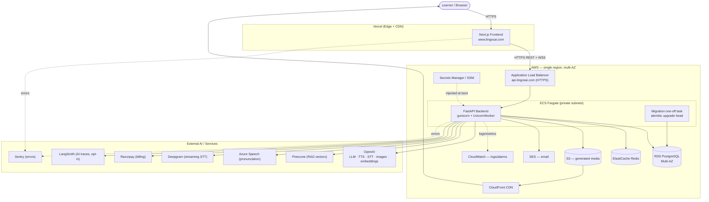
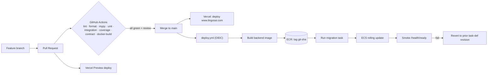
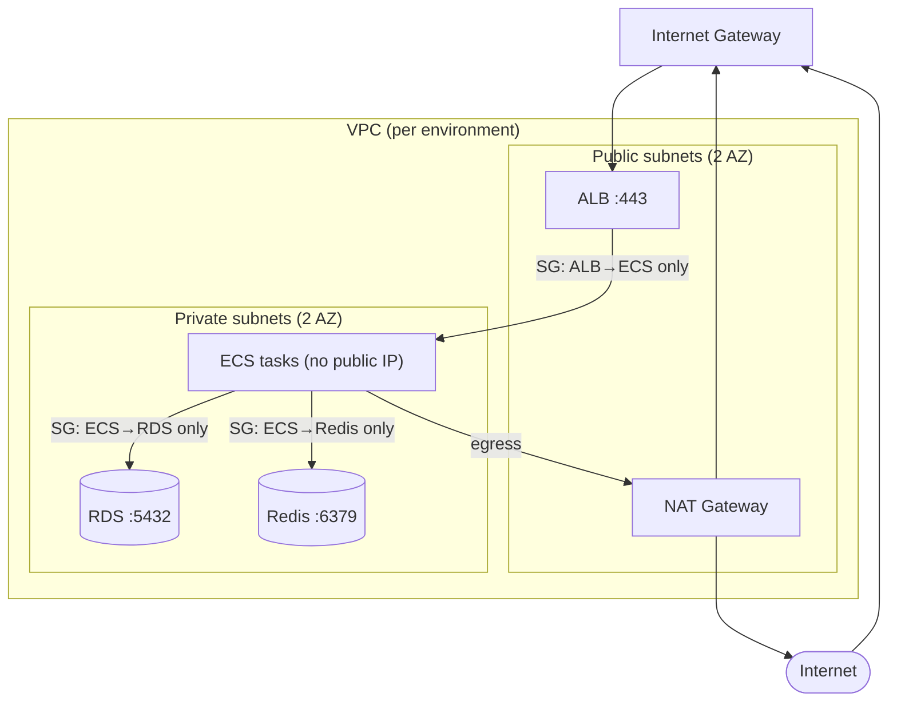
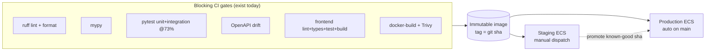

# LingosAI — Complete Production Plan (Master Go-Live Roadmap)

> **Author role:** Principal Software Architect + DevOps Engineer
> **Audience:** the solo founder (and the coding agent executing the work)
> **Goal:** ship LingosAI as a reliable production SaaS at `https://www.lingosai.com`
> **Scale target:** 0–5,000 users · single region · maximum reliability, minimum moving parts
> **Status of the code:** application is feature-complete, CI/CD + test foundation are done,
> P0 audit items mostly closed. **✅ Phase 1 (Production Hardening) is COMPLETE** (branch
> `feature/phase1-production-hardening`, 2026-06-16) and **✅ Phase 2 (CI/CD, Docker & Artifacts)
> is COMPLETE** (branch `feature/phase2-cicd-docker`, 2026-06-17); see the per-phase status banners
> below. Remaining work: AWS infra → domain/DNS/SSL → operations.
> **▶ Next session starts at [Phase 3 — AWS Infrastructure](#phase-3--aws-infrastructure).**
> This document is the master plan that ties it all together.
>
> **Companion docs (already in `docs/`):** [`PRE_PRODUCTION_PLAN.md`](./PRE_PRODUCTION_PLAN.md) ·
> [`PRE_PRODUCTION_AUDIT.md`](./PRE_PRODUCTION_AUDIT.md) · [`ci-cd.md`](./ci-cd.md) ·
> [`testing-strategy.md`](./testing-strategy.md). This file supersedes the *hosting topology* of
> the earlier plan (see "Architecture decisions that override prior docs" below).
>
> ⚠️ Parts of `docs/` are git-ignored — force-add this file: `git add -f docs/complete_production_plan.md`.

---

## Table of contents

1. [Executive summary](#0-executive-summary)
2. [Architecture decisions that override prior docs](#architecture-decisions-that-override-prior-docs)
3. [Phase 1 — Production Hardening](#phase-1--production-hardening)
4. [Phase 2 — CI/CD, Docker & Artifact Strategy](#phase-2--cicd-docker--artifact-strategy)
5. [Phase 3 — AWS Infrastructure](#phase-3--aws-infrastructure)
6. [Phase 4 — Domain, DNS, SSL & Deployment Integration](#phase-4--domain-dns-ssl--deployment-integration)
7. [Phase 5 — Production Operations & Scaling](#phase-5--production-operations--scaling)
8. [Final Recommended Architecture (diagrams)](#final-recommended-architecture)
9. [Environment Variable Matrix](#environment-variable-matrix)
10. [Launch-Day Security Checklist](#launch-day-security-checklist)
11. [Launch Readiness Checklist](#launch-readiness-checklist)
12. [Post-Launch Roadmap](#post-launch-roadmap)

---

## 0. Executive summary

LingosAI is a **modular monolith**: one FastAPI backend (SQLAlchemy 2.0 + PostgreSQL + Redis),
one Next.js frontend, and a set of AI capabilities (OpenAI, LangChain/LangSmith, Pinecone RAG,
Azure/Deepgram speech, a deterministic scoring engine). The design priority for launch is
**reliability and simplicity** — no Kubernetes, no microservices, no premature optimization.

The path to production is **five large phases**, each big enough to execute mostly end-to-end
before moving on:

| Phase | Theme | End state | Est. effort (solo) |
|---|---|---|---|
| **1 ✅ DONE** | Production hardening | App is production-*safe* (security, multi-worker, secrets, backups) | ~1 week |
| **2 ✅ DONE** | CI/CD + Docker + artifacts | Backend image + compose smoke + docker CI gate + governance shipped (AWS CD deferred to Phase 3) | ~1 week |
| **3 ◀ NEXT** | AWS infrastructure | Prod + staging infra exists and is production-ready | ~1.5 weeks |
| **4** | Domain, DNS, SSL, integration | `www.lingosai.com` + `api.lingosai.com` fully operational | ~2–3 days |
| **5** | Operations & scaling | LingosAI can be operated reliably after launch | ongoing |

**Final target topology (the one decision that drives everything else):**

- **Frontend → Vercel** (`https://www.lingosai.com`). Next.js is a first-class Vercel workload;
  this removes an entire Dockerfile, an ECS service, and ALB routing rules from the critical path.
- **Backend → AWS ECS Fargate** behind an Application Load Balancer (`https://api.lingosai.com`).
- **Data → RDS PostgreSQL + ElastiCache Redis**, private subnets only.
- **Media → S3 + CloudFront** (replacing local-disk blob storage, which cannot survive Fargate).
- **Secrets → AWS Secrets Manager / SSM**, injected as task env at boot.
- **Email → Amazon SES** (recommended) *or* keep the already-wired Resend provider — decision below.
- **Observability → Sentry (errors) + CloudWatch (infra/logs) + LangSmith (AI traces, opt-in)**.

---

## Architecture decisions that override prior docs

These are deliberate, load-bearing decisions. Each is explained where it first matters; collected
here so there is one place to see what changed and why.

| # | Decision | Rationale | Supersedes |
|---|---|---|---|
| **AD-1** | **Frontend on Vercel, not ECS.** | Next.js + Vercel is zero-ops, gives global CDN, preview deploys per PR, and automatic TLS. Putting Next.js in a container on ECS would add a Dockerfile, a service, ALB rules, and scaling concerns for no benefit at this scale. | `PRE_PRODUCTION_PLAN.md` Phase A (frontend Dockerfile) and Phase C (frontend ECS service) — **dropped**. |
| **AD-2** | **Backend only on ECS Fargate.** | Serverless containers: no EC2 to patch, scales by task count, pay-per-use. The right "boring" choice for a solo founder at 0–5k users. | — |
| **AD-3** | **Single region, multi-AZ.** `us-east-1` (matches existing Pinecone region) or the region nearest your users. | Multi-region is a 10x ops burden for a 0–5k app. Multi-AZ inside one region gives you the HA that actually matters (DB failover, task spread). | Open decision in prior plan. |
| **AD-4** | **Email: recommend Amazon SES; Resend is an acceptable keep.** Code already supports `EMAIL_PROVIDER` with a `resend` implementation. SES is cheaper at volume and AWS-native (IAM, CloudWatch). **Action:** add an `ses` provider behind the same interface; pick one for launch. | SES = $0.10/1k emails, no monthly floor; Resend = simpler, already wired. For 0–5k users either is fine — SES wins on cost once you send password/OTP/marketing email at volume. | Task asks for SES; code currently ships Resend. |
| **AD-5** | **Background work stays in-process for launch; Celery is a Stage-2 add.** Today RAG mentor-note generation runs as in-process `asyncio` tasks (`_pending_note_tasks`). Celery is **not** in the dependency set yet. | At 0–5k users in-process async is sufficient and simpler. Introduce a **single Celery worker on ECS (Redis as broker)** only when (a) note generation contends with request latency, or (b) you need retries/scheduled jobs. Do not stand up Celery on day one. | Open decision in prior plan; task lists Celery in the stack (it is planned, not yet present). |
| **AD-6** | **IaC: Terraform.** | Portable, huge community, provider-agnostic, easy to read in review. CDK is fine if you prefer TypeScript parity — but Terraform's plan/apply model is the safer default for infra you'll touch rarely. | Open decision in prior plan. |
| **AD-7** | **DNS authority: keep Namecheap as registrar; delegate `api.lingosai.com` DNS to where it's simplest.** Frontend records point at Vercel; the `api` record points at the ALB. You do **not** need Route 53 for the apex if you keep DNS at Namecheap — but Route 53 is recommended for the `api` subdomain + health checks (detailed in Phase 4). | — |

---

# Phase 1 — Production Hardening

> ## ✅ STATUS: COMPLETE — shipped 2026-06-16
> Branch `feature/phase1-production-hardening` (7 commits, **not pushed** — solo founder opens the PR).
> All checks green: backend `ruff check`/`ruff format --check`/`mypy app` clean + full `pytest` green;
> frontend `eslint` (0 errors)/`tsc --noEmit`/`vitest` (94 passed)/`next build` all pass.
>
> **What was done (task → result):**
> - **1.1 B4 multi-worker safety** — `SessionService.complete_session` now catches `IntegrityError`
>   on the `session_scorecards.session_id` unique constraint (cross-process source of truth); the
>   in-process `_completing_daily_uuids` set is now only a same-worker fast path. Regression test:
>   two racing completions → one scorecard, points applied once
>   (`tests/integration/sessions/test_lifecycle_complete.py::test_concurrent_completion_yields_one_scorecard`).
> - **1.2 OAuth state (D1)** — signed short-TTL `state` minted on `/auth/google/login`, validated on
>   callback; forged/missing/expired state is rejected.
> - **1.3 No JWT in URL (D2)** — callback redirects to `/callback?next=…` (no token); it already sets
>   the HttpOnly refresh cookie, and the frontend `/callback` page mints the access token via
>   `/auth/refresh`.
> - **1.4 Frontend API base URL (F1)** — new `frontend/src/lib/api-config.ts`
>   (`API_BASE_URL`/`WS_BASE_URL`/`resolveMediaUrl`); all ~10 duplicates import it.
> - **1.5 Prod server model** — `gunicorn` added; `backend/scripts/start-prod.sh` (UvicornWorker,
>   `WEB_CONCURRENCY` default 1, migrations NOT run here).
> - **1.6 Readiness probe** — `GET /health/ready` checks DB + Redis (503 + per-dependency breakdown);
>   `/health` stays dependency-free liveness.
> - **1.9 / 1.12 Config** — prod guard verified; `LANGCHAIN_TRACING_V2` now defaults `False`.
> - **1.7 / 1.8 / 1.10 / 1.11 / 1.13 Policy docs** — written to `docs/RUNBOOK.md` (env separation,
>   secrets+rotation, rate-limit baseline, backup/restore drill, migration policy). The AWS *mechanics*
>   (RDS automated backups, Secrets Manager injection, the migration one-off ECS task) are implemented
>   in **Phase 3** — Phase 1 fixed the policies they must follow.
>
> **Deferred to later phases (intentional):** RDS/Secrets-Manager/SES wiring (Phase 3); the
> `backup*.sql` git-history scrub (E1) and a *run* `pg_dump` restore drill remain a manual pre-launch
> step. Redis distributed lock for B4 was deliberately NOT added — the DB constraint is sufficient.

### Objective
Make the application **production-safe**: close the remaining security and correctness findings from
the audit, ensure it behaves correctly under more than one worker process, lock down secrets and
environment separation, and establish backup + migration discipline. No new infrastructure yet —
this is about making the code and config trustworthy *before* it faces the public internet.

### Why this phase exists
The app is feature-complete and has a green CI suite, but several audit findings are **"works in
dev, fails invisibly in prod"** class bugs — exactly the ones that cause silent data corruption or
account takeover once real users and multiple workers arrive. Shipping infra around un-hardened
code just means automating the delivery of those bugs. Harden first.

### Deliverables
- All P1 audit findings (B4, D1, D2, F1) closed.
- A single source of truth for the frontend API base URL.
- A documented, repeatable secrets strategy (no secrets in git, in env files committed, or in URLs).
- A production server process model (gunicorn + Uvicorn workers) with a **safe worker count**.
- A `/health/ready` readiness probe distinct from `/health` liveness.
- A documented database backup + restore procedure and a migration runbook.
- A short security review sign-off (the launch-day checklist at the end of this doc, pass 1).

### Detailed task breakdown

**1.1 — Multi-worker concurrency safety (audit B4) — _blocking for >1 worker_**
- `learning_session/service.py` uses module-global sets (`_completing_daily_uuids`,
  `_pending_note_tasks`) to dedupe session completions. These are **per-process** and silently stop
  working with more than one worker → double-scoring.
- Fix: make the **DB unique constraint the source of truth** (catch the `IntegrityError` on the
  completion row) and/or take a **short Redis lock** (Redis is already in the stack and will be
  multi-worker-safe via ElastiCache).
- Until this lands, **pin a single Uvicorn worker** and say so loudly in the Dockerfile/compose
  comments. This is the gate that lets you scale horizontally later.

**1.2 — OAuth `state` validation (audit D1)**
- `auth/routes.py` treats the OAuth `state` parameter as optional → a forged callback is accepted
  (login CSRF). Require and validate `state` on the Google login path (generate, store server-side
  or in a signed cookie, compare on callback).

**1.3 — Stop putting JWTs in redirect URLs (audit D2)**
- The OAuth success path returns the JWT in a redirect **query string** → tokens leak via proxy
  logs, browser history, and `Referer` headers. Replace with either a short-lived single-use code
  exchange or set an **HttpOnly, Secure, SameSite=Lax cookie** (the refresh-session machinery
  already exists — reuse it).

**1.4 — Centralize the frontend API base URL (audit F1)**
- `NEXT_PUBLIC_API_URL || "http://localhost:8000"` is duplicated across ~10 files. Centralize in
  `src/lib/api-config.ts` and import everywhere, so a prod misconfig fails uniformly and loudly
  rather than partially.

**1.5 — Production server process model**
- Only `uvicorn[standard]` is a dependency today. Add **gunicorn** with the
  `uvicorn.workers.UvicornWorker` class as the prod entrypoint (graceful restarts, worker
  supervision, timeouts).
- Worker count: `1` until 1.1 ships; then `(2 × vCPU) + 1` per task, but prefer **scaling task
  count over worker count** on Fargate so each task stays small and the ALB can health-check
  granularly.

**1.6 — Readiness vs liveness probes**
- `/health` (`app/main.py:122`) is liveness-only (`{"status":"ok"}`). Add `/health/ready` that
  checks **DB connectivity + Redis connectivity** so the ALB/ECS target group pulls a task with a
  broken dependency out of rotation instead of serving 500s.

**1.7 — Environment separation**
- Three environments, three configs: **development** (local `.env`), **staging** (AWS, prod-like,
  test keys), **production** (AWS, live keys). The `config.py` prod guard already refuses to boot on
  unsafe combinations under `ENVIRONMENT=production` — staging should run with `ENVIRONMENT=production`
  too (so it exercises the same guard) but with its own secrets and a `staging` CORS origin.
- The `STRICT_CONTRACTS` flag is `True` by default — keep it on in all environments so contract
  violations surface loudly.

**1.8 — Secrets strategy**
- **Never** commit real secrets; `.env` is git-ignored, `.env.production.example` is the canonical
  key list. In AWS, every secret becomes a **Secrets Manager** entry (or SSM SecureString) and is
  injected as a task-definition `secrets` block — the app reads them as ordinary env vars.
- Generate strong values: `openssl rand -hex 32` for `JWT_SECRET` and a **distinct**
  `OTP_HASHING_SECRET` (the prod guard rejects an empty one).
- Rotation policy: document how to rotate `JWT_SECRET` (invalidates sessions — do during a
  maintenance window), provider keys (OpenAI/Pinecone/Azure/Razorpay — rotate in provider console
  then update Secrets Manager → redeploy).

**1.9 — Production configuration review**
- Confirm the prod guard covers: `DEBUG=false`, `SQL_ECHO=false`, `DEV_OTP_BYPASS=false`,
  `OTP_HASHING_SECRET` set, `AUTH_COOKIE_SECURE=true`, `CORS_ORIGINS` set with **no localhost**.
- Set `CORS_ORIGINS=https://www.lingosai.com` (and the apex if you serve it). `GOOGLE_REDIRECT_URI`
  and `FRONTEND_URL` must use the production hostnames.
- `LANGCHAIN_TRACING_V2=false` by default — see the data-residency decision in 1.12.

**1.10 — Rate limiting (verify, don't rebuild)**
- AI rate limiting already exists (`AI_RATE_LIMIT_*`, `WS_*`, Redis-backed when reachable). In prod
  with ElastiCache it becomes multi-worker-safe automatically. **Verify** the limits are sane
  (`AI_RATE_LIMIT_PER_MINUTE=30` is generous — tighten later from `ai_request_logs` data) and that
  `AdminRateLimitMiddleware` is active on admin/login routes.

**1.11 — Database backup strategy**
- For launch, lean on **RDS automated backups** (Phase 3 enables them): daily snapshots +
  point-in-time recovery (PITR) with **7-day** retention to start.
- Document a **manual logical backup** procedure (`pg_dump`) for pre-migration safety nets and a
  restore drill you actually run once before launch.
- ⚠️ **History-scrub prerequisite (audit E1):** `backup*.sql` files remain in git history. If they
  ever contained production data, treat it as a disclosure risk: `git filter-repo` to purge and
  rotate any secrets they held. Decide before the repo or app becomes public.

**1.12 — LangSmith data residency (audit A5)**
- `LANGCHAIN_TRACING_V2` ships **off** in prod. Decide whether learner content may leave the
  platform; if yes, document retention and turn it on consciously. If unsure, **launch with it off**
  and enable later — your Sentry + `ai_request_logs` give you enough observability without it.

**1.13 — Database migration strategy**
- 36 Alembic migrations exist. The production rule: **migrations run as a one-off task, not on every
  container boot** (so N tasks don't race the same `alembic upgrade head`). Phase 3 implements this
  as a dedicated ECS one-off task; this phase **documents the policy** and ensures every model is
  registered in `app/models.py` (per CLAUDE.md) so autogenerate stays correct.

### Architecture decisions
- **DB constraint > in-memory guard** for idempotency (AD: correctness must survive process restarts
  and horizontal scale).
- **Cookie-based token delivery** over URL tokens (defense against log/Referer leakage).
- **Fail-fast config** is a feature: a misconfigured prod boot should crash, not degrade.
- **Single worker until B4 is cross-process** — reliability over throughput; you have headroom at
  this scale.

### Risks
| Risk | Likelihood | Impact | Mitigation |
|---|---|---|---|
| B4 fix changes completion semantics subtly | Med | High (double/zero scoring) | Cover with an integration test that fires two concurrent completions; assert one scorecard. |
| OAuth cookie change breaks login on cross-subdomain | Med | High | `SameSite=Lax` + shared registrable domain (`*.lingosai.com`) — verify on staging first. |
| Migration runbook untested → failed deploy mid-migration | Low | High | Run a full restore-then-migrate drill on staging before launch. |
| `git filter-repo` rewrites history → collaborators' clones break | Low | Med | Solo founder, so low blast radius; coordinate + re-clone. |

### Validation checklist
- [x] Two concurrent session completions produce exactly one scorecard (integration test green).
- [x] OAuth login rejects a callback with a missing/mismatched `state`.
- [x] No JWT appears in any redirect URL; token arrives via HttpOnly cookie.
- [x] `grep -r "localhost:8000" frontend/src` returns only `api-config.ts`.
- [x] App boots under gunicorn with `UvicornWorker`, single worker, locally (worker class verified).
- [x] `/health` returns 200 always-up; `/health/ready` checks DB+Redis (200 up / 503 down).
- [x] `ENVIRONMENT=production` with any unsafe flag **refuses to boot** (verified manually).
- [ ] A `pg_dump` backup can be restored into a clean database and the app runs against it.
      _(procedure documented in `docs/RUNBOOK.md`; the actual drill is a manual pre-launch step.)_

### Exit criteria
The application is **production-safe**: it can run multi-worker without double-scoring, OAuth and
token handling are not exploitable, secrets never touch git or URLs, the prod config guard is
verified, and there is a written, *tested* backup/restore + migration procedure. Only after this do
we wrap it in containers and ship it.

---

# Phase 2 — CI/CD, Docker & Artifact Strategy

> ## ✅ STATUS: COMPLETE — shipped 2026-06-17
> Branch `feature/phase2-cicd-docker` (**not pushed** — solo founder opens the PR). In-repo
> deliverables shipped; the AWS-dependent CD half (`deploy.yml` → ECR/ECS) was deliberately deferred
> to Phase 3 per §2.9 and is fully specified as a handoff in **`docs/DEPLOY.md`**.
>
> **What was done (task → result):**
> - **2.1 / 2.2 Backend image** — `backend/Dockerfile` (multi-stage, `uv`-based, **non-root**
>   `appuser` uid 10001, base images pinned by **index digest** for cross-arch reproducibility,
>   gunicorn + `UvicornWorker` entrypoint mirroring `scripts/start-prod.sh`; **migrations are NOT in
>   the entrypoint** per 1.13) + `backend/.dockerignore`. Verified locally: **117 MB** image, runs as
>   non-root, all deps import.
> - **2.3 Prod-parity compose** — `compose.prod.yml`: a one-off `migrate` service
>   (`alembic upgrade head`, models the Phase-3 migration task) gates the `backend` service, alongside
>   `postgres` + `redis` with healthchecks. `docker compose -f compose.prod.yml up` →
>   `/health/ready` 200 (verified after the fresh-DB migration fix below).
> - **2.4 / 2.7 CI** — `.github/workflows/docker.yml` job `docker-build` builds the image on PRs
>   (non-pushing) and runs a **Trivy** HIGH/CRITICAL gate (`ignore-unfixed`, `.trivyignore` allowlist).
> - **2.5 Dependabot** — `.github/dependabot.yml` (weekly `uv` + `npm` + `github-actions`).
> - **2.8 Artifact + 2.10 workflow + 2.6 Vercel** — documented in **`docs/DEPLOY.md`** (force-added):
>   three-tag scheme (`git-<sha>` / `latest` / `vYYYY.MM.DD`, deploy-by-sha), ECS rollback command,
>   branch/PR/squash workflow, the Vercel deployment model (root `frontend/`, prod = `main`, preview
>   per PR), the branch-protection `gh` command, and the Phase-3 `deploy.yml` contract.
> - **2.11 Governance** — `.github/CODEOWNERS` + `.github/pull_request_template.md`.
>
> **Migration-chain fix (surfaced by the 2.3 compose smoke, fixed 2026-06-17):** `alembic upgrade
> head` did not replay on a **fresh** DB — branch-B migrations re-added objects the sibling repair
> branch had already created (`DuplicateColumn` on `activity_evaluations.updated_at`). Fixed with
> **idempotent inspector guards** (no history rewrite) in `d1e2f3a4b5c6` (all three ops) and
> `e2f3a4b5c6d7` (`session_scorecards.activities`); safe on fresh **and** already-migrated DBs. A new
> **`migrations` job in `.github/workflows/backend.yml`** runs `alembic upgrade head` against an empty
> Postgres so this never regresses (the unit/integration suites use SQLite `create_all` and never
> exercise the migration graph). **This de-risks the Phase 3 fresh-RDS migration task.**
>
> **Deferred to Phase 3 (intentional):** `deploy.yml` (OIDC → ECR push → migration one-off task →
> ECS rolling deploy → smoke), the ECR repo, the GitHub OIDC role, and the ECS cluster/service/task
> definitions. **Founder dashboard actions (post-push):** connect Vercel (root `frontend/`) and enable
> branch protection on `main` (exact `gh` command in `docs/DEPLOY.md`, contexts:
> `lint·types·unit·integration·coverage·ci·openapi-drift·docker-build`).

### Objective
Turn the green-on-a-laptop repo into a **build-and-ship pipeline**: a small, secure, reproducible
backend container image; a clean Vercel deployment model for the frontend; and GitHub Actions that
gate every change and produce a deployable artifact on every merge to `main`.

### Why this phase exists
You cannot deploy what you cannot reproducibly build. The CI *test* foundation is done (lint, ruff
format, mypy, full pytest @ 73% floor, frontend lint/types/test/build, OpenAPI drift) — what's
missing is **containerization** and the **build/artifact/deploy** half of CI/CD. This phase produces
the artifact and the workflow that makes "merge to `main`" mean "ready to deploy."

### Deliverables
- `backend/Dockerfile` — multi-stage, slim, non-root, `uv`-based.
- `backend/.dockerignore`.
- `compose.prod.yml` — local prod-parity smoke test (app + Postgres + Redis).
- Container security scanning in CI (Trivy or `docker scout`).
- A documented **Vercel deployment model** for the frontend (no Dockerfile — AD-1).
- A `docker-build` validation job in CI (build the image on every PR; don't push).
- An image **tagging + versioning + rollback** scheme.
- A documented **Git branching + deployment workflow** (feature branch → PR → CI → merge → deploy).
- `.github/CODEOWNERS`, `.github/pull_request_template.md`, and branch protection on `main`.

### Detailed task breakdown

**2.1 — Backend Dockerfile (multi-stage, optimized)**
- **Builder stage:** a `uv`-enabled Python 3.11 base; `uv sync --frozen` against the committed lock
  so the build is byte-reproducible; compile bytecode.
- **Runtime stage:** slim Python base, copy only the virtualenv + app, run as a **non-root user**,
  no build toolchain in the final image. Target a small final image (well under ~300 MB).
- **Entrypoint:** start gunicorn + `UvicornWorker`. **Do not** run `alembic upgrade head` here —
  migrations are a separate one-off task (Phase 1.13 / Phase 3). State the single-worker pin in a
  comment until B4 is cross-process.

**2.2 — `.dockerignore`**
- Exclude `.venv`, `node_modules`, `app/ai/**/_cache/`, `tests/`, `.env*`, `.git`, `*.sql`, docs.
  This shrinks build context, speeds builds, and prevents secrets/caches leaking into layers.

**2.3 — Image optimization**
- Layer ordering: dependencies before app code so code edits don't bust the dep cache.
- Use `--mount=type=cache` for `uv` if using BuildKit; pin the base image by digest for
  reproducibility; set `PYTHONDONTWRITEBYTECODE`/`PYTHONUNBUFFERED`.

**2.4 — Container security scanning**
- Add **Trivy** (or `docker scout`) as a CI step on the built image: fail the build on HIGH/CRITICAL
  OS/package CVEs (allowlist with justification where unavoidable). Run on every PR that touches the
  Dockerfile or deps.

**2.5 — Dependency management**
- Backend: `pyproject.toml` already pins exact versions + lockfile — keep `uv sync --frozen` in both
  CI and the image. Add **Dependabot** (or Renovate) for weekly dep PRs (pip + GitHub Actions + npm).
- Frontend: `package-lock.json` is committed; Vercel installs from it.

**2.6 — Frontend build & environment strategy (Vercel)**
- Connect the GitHub repo to Vercel; the project root is `frontend/`.
- **Production branch = `main`** → deploys to `https://www.lingosai.com`.
- **Preview deploys** on every PR (free, ephemeral URLs) — your manual QA surface.
- Environment variables in Vercel, scoped to Production / Preview / Development:
  - `NEXT_PUBLIC_API_URL=https://api.lingosai.com` (Production),
    `=https://api-staging.lingosai.com` (Preview), `=http://localhost:8000` (Development).
- Build command `next build`; Vercel handles CDN, TLS, and image optimization. **No Dockerfile.**

**2.7 — GitHub Actions: confirm + extend**
- **Already done & blocking** (do not rebuild): `backend.yml` (ruff lint + `ruff format --check` +
  mypy + unit + integration + coverage `--cov-fail-under=73`), `frontend.yml` (eslint + `tsc
  --noEmit` + Vitest + `next build`), `contract.yml` (OpenAPI drift), `backend-curriculum.yml`.
- **Add:** a `docker-build` job that builds the backend image on PRs touching backend/Docker (proves
  the image compiles) and runs Trivy. Non-pushing.
- **Add (Phase 3 wires the deploy target):** `deploy.yml` — see 2.9.

**2.8 — Artifact strategy: tagging, versioning, rollback**
- **Registry:** Amazon ECR (`lingosai-backend`). One repo; frontend has no image (Vercel).
- **Tags per image:** push **three** tags on every `main` build —
  1. `git-<short-sha>` (immutable, the real identity),
  2. `latest` (convenience for humans only — never deploy by `latest`),
  3. a semver/date tag (`v2026.06.16` or `1.4.0`) for human-readable releases.
- **Deploy by digest/sha**, never by `latest`, so a deploy is exactly reproducible.
- **Rollback:** ECS keeps prior task-definition revisions. Rollback = `aws ecs update-service` back
  to the previous task-def revision (which references the previous image sha). Document the exact
  command in `DEPLOY.md`. Because images are immutable-by-sha, rollback is instant and safe.

**2.9 — CD pipeline (`deploy.yml`)** *(target created in Phase 3)*
- Trigger: push to `main`, **after** required checks pass.
- Steps: assume an AWS role via **GitHub OIDC** (no long-lived AWS keys in secrets) → build image →
  push to ECR with the three tags → register a new task-definition revision → run the **migration
  one-off task** → `aws ecs update-service` (rolling deploy, `minimumHealthyPercent`/`maximumPercent`
  tuned so there's no downtime) → wait for the service to stabilize → smoke-check `/health/ready`.
- Ship it **non-blocking first** (manual approval / `workflow_dispatch`), then make it automatic once
  you trust it.

**2.10 — Branching & deployment workflow (the human process)**
```
main (protected, always deployable)
  └── feature/<short-name>  ──► open PR
            │
            ├─ CI runs: lint · format · mypy · unit · integration · coverage · contract · docker-build
            ├─ Vercel posts a Preview deploy URL for manual QA
            ├─ review (CODEOWNERS) + green checks required
            ▼
        merge to main  ──►  deploy.yml: build → ECR → migrate → ECS rolling deploy → smoke test
                            Vercel: auto-deploys frontend to production
```
- **One protected branch (`main`)** + short-lived feature branches. No long-running `develop` branch
  at this scale — staging is an *environment*, not a branch (you can deploy any branch/sha to staging
  manually via `workflow_dispatch`).
- Squash-merge to keep `main` history linear and each merge = one deployable unit.

**2.11 — Repo governance**
- `.github/CODEOWNERS` (you own everything for now — still useful for required-review enforcement).
- `.github/pull_request_template.md` (checklist: tests, migration?, env var added?, security note).
- Branch protection on `main` (a repo *setting*, set via `gh` or UI — not a file). Required contexts
  must match job names, e.g.:
  ```bash
  gh api -X PUT repos/:owner/:repo/branches/main/protection \
    -F 'required_status_checks.contexts[]=lint' \
    -F 'required_status_checks.contexts[]=types' \
    -F 'required_status_checks.contexts[]=unit' \
    -F 'required_status_checks.contexts[]=integration' \
    -F 'required_status_checks.contexts[]=coverage' \
    -F 'required_status_checks.contexts[]=ci' \
    -F 'required_status_checks.contexts[]=openapi-drift' \
    -F 'required_status_checks.contexts[]=docker-build' \
    -F required_pull_request_reviews.required_approving_review_count=1 \
    -F enforce_admins=true -F restrictions=
  ```

### Architecture decisions
- **Immutable, sha-tagged images; deploy by sha.** Reproducibility and trivial rollback.
- **No frontend container.** Vercel is the build+host+CDN+TLS for the frontend (AD-1).
- **OIDC for AWS auth from CI.** No static cloud credentials in GitHub secrets — short-lived,
  auditable role assumption.
- **Migrations decoupled from container start.** Prevents N-task migration races.

### Risks
| Risk | Likelihood | Impact | Mitigation |
|---|---|---|---|
| Image bloat / slow builds | Med | Low | Multi-stage, `.dockerignore`, layer caching, BuildKit cache mounts. |
| Migration task fails mid-deploy | Low | High | Migration runs *before* service update; on failure, abort deploy (old tasks keep serving). |
| OIDC role over-privileged | Med | High | Scope the CI role to ECR push + ECS update + pass-role for the task roles only. |
| Trivy noise blocks shipping | Med | Low | Allowlist with documented justification; only HIGH/CRITICAL gate. |

### Validation checklist
- [x] `docker build` produces a runnable backend image < ~300 MB, runs as non-root. _(117 MB, `appuser`.)_
- [x] `docker compose -f compose.prod.yml up` boots app + Postgres + Redis; `/health/ready` is 200.
      _(Verified after the fresh-DB migration fix; a new `migrations` CI job guards regression.)_
- [x] Trivy reports no un-allowlisted HIGH/CRITICAL CVEs. _(Gate wired in `docker.yml`; runs per PR.)_
- [ ] A PR shows all required checks + a Vercel preview URL. _(After push + Vercel connect — founder.)_
- [ ] A merge to `main` produces an ECR image tagged with the git sha. _(Phase 3 — `deploy.yml`.)_
- [ ] Rollback command (revert to prior task-def revision) is documented and tested on staging.
      _(Documented in `docs/DEPLOY.md`; the staging *test* is a Phase 3 step.)_

### Exit criteria
Every merge to `main` produces an **immutable, scanned, sha-tagged image** in ECR and (once Phase 3
exists) triggers an automatic, zero-downtime rolling deploy with migrations run safely first; the
frontend auto-deploys to Vercel; branch protection prevents un-reviewed, un-tested code from
reaching `main`. **Every merge to `main` is automatically deployable.**

---

# Phase 3 — AWS Infrastructure

> ## 🟡 STATUS: CODE + IaC SHIPPED — applies pending (founder) — 2026-06-17
> Branch `feature/phase3-aws-infra`. The two real **code items** and all **IaC + CD** are written,
> reviewed, and green (backend `ruff`/`mypy`/`pytest` all pass; `deploy.yml` is valid YAML). What
> remains is **account-side** work only the founder can run — captured step-by-step in
> **[`docs/AWS_SETUP.md`](./AWS_SETUP.md)**.
>
> **What was done (task → result):**
> - **3.5 `S3BlobStorage` (the hard launch blocker)** — implemented against the existing
>   `IBlobStorage` Protocol with a `build_blob_storage()` factory selected by `STORAGE_BACKEND`
>   (`local`|`s3`); public media → CloudFront, private learner audio → a **separate** bucket served
>   through the owner-checked `/responses/audio` route (never CDN). All ~6 call-sites migrated; local
>   mode unchanged. New config: `STORAGE_BACKEND`/`MEDIA_S3_BUCKET`/`MEDIA_PRIVATE_S3_BUCKET`/
>   `MEDIA_S3_REGION`/`MEDIA_CDN_URL`; prod guard requires bucket+CDN in s3 mode. `boto3` added.
> - **3.7 SES provider (AD-4, SES chosen)** — `SESEmailClient` behind `EMAIL_PROVIDER=ses`,
>   authenticating via the ECS task role (no key in env). Unit tests use injected fakes (no live AWS).
> - **3.1–3.4, 3.6, 3.8 Terraform** — `infra/terraform/`: a reusable `stack` module composes network
>   (VPC/2-AZ/1-NAT/4 SGs), data (RDS Multi-AZ + Redis, private), media (public S3+CloudFront OAC +
>   private S3), secrets (TF-owned URLs + empty app secrets), email (SES identity), ALB
>   (`/health/ready`, HTTPS in Phase 4), compute (per-env ECR, ECS service + migration task def,
>   scoped IAM roles), observability (SNS + high-signal alarms), and cicd (GitHub OIDC + scoped deploy
>   role). `staging` + `production` roots; production owns the account-global OIDC provider + SES
>   identity, so it applies first. Bootstrap root for remote state.
> - **2.9 `deploy.yml` (CD)** — OIDC → ECR push (3 tags) → migration one-off task (gated on exit 0) →
>   ECS rolling deploy → wait stable → smoke `/health/ready`; per-env config via GitHub Environments.
>
> **Founder actions (account-side, runbook'd in `docs/AWS_SETUP.md`):** grant Terraform IAM, bootstrap
> remote state, `terraform apply` production then staging, populate Secrets Manager, request SES
> production access + (Phase 4) publish DNS, set the GitHub Environment variables, run the first
> deploy, and walk the validation drills. **ACM/HTTPS + custom domains are deferred to Phase 4** (the
> ALB serves HTTP until the cert ARN is supplied).

> ## ▶ START HERE — inherited from Phases 1–2
> - **Container is ready:** `backend/Dockerfile` (non-root, gunicorn, no migrations in entrypoint) +
>   `compose.prod.yml` already model the runtime. Phase 3 pushes this same image to **ECR** and runs
>   it on **Fargate** — no new image work.
> - **CD is the gap:** create `deploy.yml` (OIDC → ECR push → migration one-off task → ECS rolling →
>   smoke). Its exact contract is in **`docs/DEPLOY.md` §6** — Phase 3 only fills in resource names.
> - **Migrations replay cleanly on a fresh DB** (fixed in Phase 2 + guarded by the `migrations` CI
>   job), so the **migration one-off task (3.4)** against fresh staging/prod RDS is now low-risk.
> - **Two real code/launch items remain:** `S3BlobStorage` (3.5 — the hard launch blocker; local-disk
>   media can't survive Fargate) and the SES provider decision (3.7 / AD-4).
> - **Founder dashboard prerequisites** (do before/with Phase 3): connect Vercel and enable `main`
>   branch protection — both detailed in `docs/DEPLOY.md`.

### Objective
Stand up the complete, production-ready AWS environment — networking, compute, data, media, secrets,
email, and observability — as **Terraform code**, with a **production** and a **staging** environment
that differ only in size and secrets.

### Why this phase exists
This is the substrate the backend runs on. Doing it as IaC (not ClickOps) makes it reviewable,
reproducible, and recoverable — which is the whole point of "maximum reliability" for a solo founder
who cannot afford to remember which checkbox they clicked at 2am.

### Deliverables
- A Terraform repo/module set producing: VPC + subnets + NAT, security groups, ALB, ECS cluster +
  backend service + migration task, ECR, RDS, ElastiCache, S3 + CloudFront, Secrets Manager entries,
  SES domain identity, CloudWatch log groups + alarms, and the GitHub OIDC role.
- Two workspaces/state files: `staging` and `production`.
- An `S3BlobStorage` implementation in the app (the one real code item this phase requires).
- A documented backup + disaster-recovery plan.

### Service-by-service design (and why each is chosen)

| AWS service | Role in LingosAI | Why this and not the alternative |
|---|---|---|
| **VPC** | Network isolation boundary | One VPC per environment; everything else lives inside it. |
| **ECS Fargate** | Runs the FastAPI backend container | Serverless containers: no EC2 to patch/scale/secure. Kubernetes is overkill at this scale (AD-2). |
| **ECR** | Stores the backend image | Native to ECS, IAM-integrated, image scanning built in. |
| **Application Load Balancer (ALB)** | TLS termination + health-checked routing to tasks | Layer-7, integrates with ACM for free certs and with ECS target groups; supports WebSockets (needed for the learning-session WS). |
| **RDS PostgreSQL** | Primary datastore | Managed Postgres: automated backups, PITR, Multi-AZ failover, minor-version patching. Self-managing Postgres on EC2 is a liability for a solo founder. |
| **ElastiCache (Redis)** | Rate-limit buckets, the B4 lock, future Celery broker | Managed Redis, Multi-AZ option; matches the `REDIS_URL` the app already expects. |
| **S3** | Generated media (TTS/STT/imagegen/pronunciation), blog media, learner audio | Durable object storage; replaces ephemeral local disk that cannot survive Fargate or >1 task. |
| **CloudFront** | CDN in front of S3 media | Low-latency media delivery + signed URLs; offloads bandwidth from the backend. |
| **SES** | Transactional email (OTP, password, contact) | Cheap, AWS-native, IAM + CloudWatch integration (AD-4). |
| **Secrets Manager / SSM** | All secrets, injected as task env | Centralized, rotatable, never in git; ECS task-def `secrets` block reads them natively. |
| **CloudWatch** | Logs, metrics, alarms, dashboards | Native sink for ECS/RDS/ALB; one place for infra observability. |
| **Route 53** *(api subdomain)* | DNS for `api.lingosai.com` + ALB alias + health checks | Alias records to the ALB and health-check-driven failover; see Phase 4. |

### Network architecture
- **One VPC** per environment, across **2 Availability Zones** (Multi-AZ = the HA that matters).
- **Public subnets (2):** the ALB and the NAT gateway only.
- **Private subnets (2):** ECS tasks, RDS, ElastiCache. **No public IPs.**
- **NAT gateway:** lets private tasks reach the internet (OpenAI, Pinecone, Azure, SES, Razorpay).
  *Cost note:* NAT is one of the pricier line items — **one** NAT gateway (single-AZ) is acceptable
  at launch to save cost; accept that an AZ outage of the NAT AZ degrades egress, and revisit at
  Stage 2.
- **Security groups (least privilege):**
  - ALB SG: inbound `443` from `0.0.0.0/0`; outbound to the ECS SG only.
  - ECS SG: inbound from the ALB SG only; outbound to RDS SG, Redis SG, and `443` to the internet.
  - RDS SG: inbound `5432` **from the ECS SG only**.
  - Redis SG: inbound `6379` **from the ECS SG only**.
- **VPC endpoints (optional, Stage 2):** S3 gateway endpoint + ECR/Secrets Manager interface
  endpoints reduce NAT egress cost and keep traffic on the AWS backbone.

### Detailed task breakdown

**3.1 — Terraform foundation**
- Remote state in **S3 + DynamoDB lock table**. Two workspaces (`staging`, `production`) or two
  state keys. Tag every resource with `Environment` and `Project=lingosai`.

**3.2 — Networking** — VPC, 2 public + 2 private subnets, IGW, NAT, route tables, the four SGs above.

**3.3 — Data tier**
- **RDS:** PostgreSQL (match the major version you develop against), `db.t4g.micro`/`small` to start,
  **Multi-AZ ON for production** (single-AZ acceptable for staging to save cost), storage autoscaling,
  automated backups **7-day** retention + PITR, deletion protection ON, encrypted at rest. The app's
  `database.py` rewrites `postgresql://` → `postgresql+psycopg://`, so store the plain URL.
- **ElastiCache Redis:** `cache.t4g.micro`, Multi-AZ for production, encryption in transit/at rest,
  in the private subnets.

**3.4 — Compute**
- **ECS cluster** (Fargate). **Backend service:** desired count `1` (autoscale later), task with the
  ECR image, CloudWatch log driver, the `secrets` block, a **task role** (S3 read/write to the media
  bucket, SES send, Secrets Manager read) and a separate **execution role** (ECR pull, log write).
- **ALB target group** with health check on `/health/ready`; HTTP→HTTPS redirect; the WebSocket
  route works through the ALB natively (sticky sessions not required — the WS layer is stateless per
  the orchestrator design).
- **Migration one-off task:** same image, command `alembic upgrade head`, run by `deploy.yml` before
  the service update.

**3.5 — Media: S3 + CloudFront + the `S3BlobStorage` code item** *(real code)*
- TTS/STT/imagegen/pronunciation/blog output is written to **local disk** by `LocalBlobStorage`
  (`app/ai/storage/local_client.py`) and served via `StaticFiles`. This **cannot** survive Fargate's
  ephemeral filesystem or >1 task.
- Implement `S3BlobStorage` against the existing `app/ai/storage/interface.py`; select it by env in
  prod; serve via CloudFront. The `*_CACHE_DIR` / `*_PUBLIC_URL_PREFIX` keys become S3 prefixes +
  CDN URLs. Learner audio (`LEARNER_AUDIO_DIR`) must stay **private** (owner-checked route /
  pre-signed URLs), not public CloudFront.

**3.6 — Secrets** — create a Secrets Manager entry per sensitive key in `.env.production.example`
(`DATABASE_URL`, `REDIS_URL`, `JWT_SECRET`, `OTP_HASHING_SECRET`, `OPENAI_API_KEY`, `PINECONE_*`,
`AZURE_SPEECH_KEY`, `DEEPGRAM_API_KEY`, `GOOGLE_CLIENT_*`, `RAZORPAY_*`, `SENTRY_DSN`,
`RESEND_API_KEY`/SES uses IAM, `LANGCHAIN_API_KEY`). Non-secret config (`CORS_ORIGINS`, model names)
can be plain task-def env or SSM parameters.

**3.7 — Email (SES)** — verify the `lingosai.com` domain identity, add DKIM + SPF + DMARC records
(Phase 4 publishes them), request **production sending access** (move out of the SES sandbox — this
takes AWS a day, do it early), and grant the ECS task role `ses:SendEmail`. Add the `ses` provider
behind `EMAIL_PROVIDER` (AD-4) or keep Resend and skip SES IAM.

**3.8 — Observability** — CloudWatch log groups per service with retention (30 days), metric alarms
(see Phase 5), and a dashboard. Sentry DSN via secret. `LANGCHAIN_TRACING_V2` per the 1.12 decision.

**3.9 — Backup & disaster recovery plan**
- **RDS:** automated daily snapshots + PITR (7-day). **Monthly** manual snapshot retained longer
  (e.g. 90 days) for a "known-good" restore point.
- **S3 media:** enable **versioning** + a lifecycle rule; cross-region replication is *not* needed at
  this scale.
- **DR runbook (RTO/RPO):** target **RPO ≤ 5 min** (PITR) and **RTO ≤ 1 hr** (restore snapshot to a
  new RDS, repoint `DATABASE_URL`, redeploy). Write it down and **run the restore drill once** before
  launch — an untested backup is not a backup.
- **Terraform state** is itself critical — the S3 state bucket is versioned so a bad apply can be
  rolled back.

### Architecture decisions
- **Private-subnet data tier, SG-scoped to ECS only.** The database is never reachable from the
  internet.
- **Multi-AZ for prod data, single-AZ for staging.** HA where it counts, cost savings where it
  doesn't.
- **One NAT gateway at launch** as a deliberate cost trade-off, revisited at Stage 2.
- **Media in S3/CloudFront, not on the task.** The single change that makes the backend horizontally
  scalable and stateless.

### Risks
| Risk | Likelihood | Impact | Mitigation |
|---|---|---|---|
| `S3BlobStorage` not done → media 404s in prod | High if skipped | High | This is a **hard launch blocker**, not optional infra. Gate launch on it. |
| SES still in sandbox at launch → only verified addresses get email | Med | High | Request production access in week 1 of Phase 3. |
| RDS undersized → CPU credit exhaustion under load | Med | Med | Start `t4g.small`, alarm on CPU credits, scale instance class when alarms fire. |
| Terraform state corruption / drift | Low | High | Remote state + DynamoDB lock + versioned bucket; `terraform plan` reviewed before every apply. |
| NAT single-AZ outage | Low | Med | Accepted at launch; documented; promote to per-AZ NAT at Stage 2. |

### Validation checklist
- [ ] `terraform plan` is clean and reviewed for both `staging` and `production`.
- [ ] Backend task starts, passes `/health/ready`, and the ALB shows the target healthy.
- [ ] RDS is **not** reachable from the public internet (verify from outside the VPC).
- [ ] The migration one-off task runs `alembic upgrade head` successfully against staging RDS.
- [ ] A TTS/image generation in prod writes to **S3** and serves via CloudFront (not local disk).
- [ ] A test email sends via SES (production access granted) to an arbitrary address.
- [ ] A secret rotated in Secrets Manager is picked up after a redeploy.
- [ ] An RDS snapshot restore drill completes within the RTO target.

### Exit criteria
Production and staging infrastructure exist as reviewed Terraform, the backend runs healthy on
Fargate behind the ALB with all data in private subnets, media is served from S3/CloudFront, secrets
come from Secrets Manager, email sends via SES (or Resend), and there is a **tested** backup + DR
plan. The infrastructure is production-ready and waiting for a domain.

---

# Phase 4 — Domain, DNS, SSL & Deployment Integration

### Objective
Wire the purchased domain so that `https://www.lingosai.com` serves the Vercel frontend and
`https://api.lingosai.com` serves the ECS backend, with valid TLS everywhere, a clear canonical-host
redirect policy, and secure cross-origin communication between the two.

### Why this phase exists
Until DNS, TLS, and CORS/cookies are correct end-to-end, the deployed pieces from Phases 1–3 can't
actually talk to each other or to users. This phase is small but high-stakes — a wrong cookie domain
or CORS origin silently breaks auth.

### Deliverables
- DNS records at Namecheap (and optionally a Route 53 hosted zone for `api`).
- Vercel custom-domain configuration with automatic TLS for the frontend.
- An ACM certificate on the ALB for `api.lingosai.com`.
- A documented, working **www-vs-apex canonical** decision with redirects.
- Verified secure frontend↔backend communication (CORS + cookies).
- The exact production environment-variable values for both sides.

### Architecture decisions

**4.1 — Canonical host: `www.lingosai.com` is canonical.**
- The purchased/intended brand URL is `https://www.lingosai.com`, and `www` plays nicer with CDNs
  (you can CNAME `www` to Vercel; you cannot CNAME a bare apex per strict DNS, only ALIAS/ANAME).
- **Redirect the apex → www:** `lingosai.com` → `https://www.lingosai.com` (301). Vercel handles
  this automatically when you add both domains and pick `www` as primary.
- Result: one canonical origin for SEO, cookies, and CORS.

**4.2 — Subdomain split.**
- `www.lingosai.com` → **Vercel** (frontend).
- `lingosai.com` (apex) → **Vercel**, 301 → `www`.
- `api.lingosai.com` → **AWS ALB** (backend).
- This keeps frontend and backend on the **same registrable domain** (`lingosai.com`), which is
  required for the refresh cookie (`SameSite=Lax` across `www.` and `api.` subdomains works; the
  cookie `Domain` is set to `.lingosai.com`).

### Detailed task breakdown

**4.3 — Frontend DNS + TLS (Vercel)**
- In Vercel: add domains `www.lingosai.com` (primary) and `lingosai.com` (redirect to primary).
- At Namecheap:
  - `www` → **CNAME** → `cname.vercel-dns.com` (value Vercel shows you).
  - apex `@` → Vercel's recommended **A/ALIAS** record (Vercel provides the apex target; Namecheap
    supports ALIAS-style via "URL Redirect" or an A record to Vercel's anycast IP — follow Vercel's
    domain wizard exactly).
- Vercel auto-provisions + renews the TLS cert. No action beyond DNS.

**4.4 — Backend DNS + TLS (AWS)**
- Request an **ACM certificate** for `api.lingosai.com` (in the ALB's region). Validate via **DNS**:
  ACM gives a `CNAME` validation record → add it at Namecheap (or in a Route 53 zone). Validation is
  automatic once the record propagates.
- Point `api.lingosai.com` at the ALB:
  - **Option A (recommended): Route 53 hosted zone for the `api` subdomain** — create the zone, add
    an **A/ALIAS** record `api.lingosai.com` → the ALB, and at Namecheap delegate `api` via NS
    records to that zone. Gives you alias + health checks.
  - **Option B (simplest): CNAME at Namecheap** — `api` → the ALB's DNS name. Works; no health-check
    failover, and you can't CNAME the apex (fine, since `api` is a subdomain).
- Attach the ACM cert to the ALB's **HTTPS:443 listener**; add an **HTTP:80 → 443 redirect**.

**4.5 — Redirect strategy**
- Apex → `www` (301, by Vercel).
- HTTP → HTTPS everywhere (Vercel for the frontend; ALB listener rule for the API).
- Enable **HSTS** on both (Vercel header + a FastAPI/ALB response header) once you're confident TLS
  is stable — start with a short `max-age`, then raise.

**4.6 — Secure frontend↔backend communication**
- **CORS:** backend `CORS_ORIGINS=https://www.lingosai.com` (and apex if you ever serve it directly).
  The middleware is already method/header-restricted.
- **Cookies:** `AUTH_COOKIE_SECURE=true`, `SameSite=Lax`, `Domain=.lingosai.com` so the refresh
  cookie set by `api.lingosai.com` is sent on requests the frontend triggers. Verify login →
  refresh → logout across the subdomains on staging first.
- **OAuth:** `GOOGLE_REDIRECT_URI=https://api.lingosai.com/auth/google/callback`; register that exact
  URI in the Google Cloud console. `redirect_slashes=False` is deliberate (avoids the 307 on the
  callback) — keep it.

**4.7 — Environment variables to set**
- **Vercel (frontend, Production):** `NEXT_PUBLIC_API_URL=https://api.lingosai.com`.
- **AWS task (backend, production):** `CORS_ORIGINS=https://www.lingosai.com`,
  `FRONTEND_URL=https://www.lingosai.com`, `GOOGLE_REDIRECT_URI=https://api.lingosai.com/auth/google/callback`,
  `AUTH_COOKIE_SECURE=true`, plus all secrets from Phase 3.
- **Staging mirror:** `www-staging`/`api-staging` (or Vercel preview URL + `api-staging.lingosai.com`)
  with the same shape and test keys.

### Risks
| Risk | Likelihood | Impact | Mitigation |
|---|---|---|---|
| Cookie `Domain`/`SameSite` wrong → login "works then logs out" | Med | High | Test the full auth loop across subdomains on staging before flipping prod DNS. |
| ACM validation record missed → cert never issues → API has no TLS | Med | High | Add the DNS validation CNAME immediately; ACM shows "Issued" only after propagation. |
| DNS propagation delay during cutover | High | Low | Lower TTLs to 300s a day before cutover; cut over during low traffic. |
| OAuth redirect URI mismatch → Google login 400 | Med | Med | Register the exact prod URI; test the OAuth flow on staging. |

### Validation checklist
- [ ] `https://www.lingosai.com` loads the app with a valid cert; `http://` and apex 301 to it.
- [ ] `https://api.lingosai.com/health` returns 200 over a valid ACM cert.
- [ ] A login on `www` sets a `Secure`, `SameSite=Lax`, `.lingosai.com` cookie and survives a refresh.
- [ ] CORS preflight from `www.lingosai.com` to `api.lingosai.com` succeeds; a random origin is rejected.
- [ ] Google OAuth completes end-to-end on production hostnames.
- [ ] `curl -I http://api.lingosai.com` shows a redirect to HTTPS.

### Exit criteria
The domain is fully operational: both hosts serve over valid TLS, the canonical redirect is in place,
the frontend talks to the backend with working CORS + cookies + OAuth, and every required environment
variable is set on both Vercel and AWS. **LingosAI is reachable and functional at its real domain.**

---

# Phase 5 — Production Operations & Scaling

### Objective
Make LingosAI **operable** after launch: know when something is wrong (monitoring), be able to find
out why (logging), know whether the business is working (metrics), have a plan for growth (scaling
stages), and have written procedures for the things that happen under stress (incidents, rollbacks,
deploys, maintenance, cost control).

### Why this phase exists
Launching is one event; operating is forever. A solo founder cannot hold the runbook in their head at
3am. This phase converts tribal knowledge into checklists and dashboards so the system can be run
calmly and cheaply.

### Deliverables
- Monitoring dashboards + alerts across Sentry, CloudWatch, LangSmith.
- A structured-logging + audit-log + AI-log strategy and where each lands.
- A business-metrics dashboard (DAU, task completion, AI cost, conversion).
- A three-stage scaling plan with explicit triggers.
- Operational runbooks: incident response, rollback, deploy, weekly + monthly maintenance.
- A cost-optimization strategy.

### Detailed task breakdown

**5.1 — Monitoring**
- **Sentry** (already wired, no-op when DSN empty): errors + performance traces (10% sample) for the
  backend; add the Sentry Next.js SDK on the frontend (Vercel-friendly). Alert on new issue spikes.
- **CloudWatch alarms** (the ones that page you): ALB 5xx rate, ALB target unhealthy count, ECS CPU/
  memory high, RDS CPU/credit-balance/free-storage/connections, Redis memory/evictions, NAT errors.
  Route alarms to **SNS → email/SMS** (one on-call: you).
- **LangSmith** (opt-in per 1.12): AI trace inspection, prompt/latency/cost per chain — turn on when
  data-residency is decided. Until then, `ai_request_logs` covers operational AI metrics.
- **Synthetic uptime check:** a simple external monitor (e.g. a free uptime service or a Route 53
  health check) hitting `/health` every minute → alerts you before users do.

**5.2 — Logging**
- **Structured logs:** JSON logs to stdout → CloudWatch Logs. The app already has a `TraceIDMiddleware`
  — ensure the trace id is in every log line so a request can be followed across services. Per audit
  D5, log `user.id`, **never** email/PII.
- **Audit logs:** admin mutations already go to `app/modules/admin/audit_service.py` (DB-backed) —
  keep these queryable; they're your "who changed what" record.
- **AI logs:** `ai_request_logs` (latency/tokens/status/trace_id, `AI_REQUEST_LOGGING_ENABLED=true`)
  and `ai_evaluations` (LLM-as-judge sampling) — these are your AI-cost and AI-quality ledgers.
- **Retention:** CloudWatch 30 days (cost), audit/AI logs in Postgres as long as cheap.

**5.3 — Business metrics**
- **DAU/WAU:** distinct users with a session/activity per day (query `progress`/session tables).
- **Task completion rate:** completed vs started activities (the scoring-writer replay guard makes
  "first attempt" well-defined).
- **AI cost tracking:** sum tokens × model price from `ai_request_logs`, grouped by capability — this
  is your single most important variable cost. Put it on the dashboard.
- **Conversion metrics:** trial-start → paid (Razorpay), funnel from signup → diagnosis → first
  session → day-7 retention.
- Surface these in a lightweight admin dashboard or a scheduled query; you don't need a BI stack at
  this scale.

**5.4 — Scaling strategy (explicit triggers, not vibes)**

| Stage | Users | Posture | What to do |
|---|---|---|---|
| **Stage 1** | 0–500 | **Minimum footprint.** 1 backend task (single worker until B4 is cross-process), `t4g.micro/small` RDS Multi-AZ, `t4g.micro` Redis, 1 NAT. | Watch dashboards; tune AI rate limits from real `ai_request_logs`; don't add capacity you don't need. |
| **Stage 2** | 500–5,000 | **Scale out the stateless tier.** Finish B4 → flip to **multi-worker + ECS autoscaling** (target-tracking on CPU / request count, e.g. 2–4 tasks). Bump RDS instance class; consider moving RAG note generation to a **Celery worker** (AD-5). | Add per-AZ NAT or VPC endpoints; enable RDS read replica only if reads dominate. |
| **Stage 3** | 5,000–20,000 | **Optimize cost + resilience.** Right-size with reserved capacity / Savings Plans / Fargate Spot for non-critical tasks; CloudFront caching for media; review DB indexing + slow queries; introduce a dedicated queue (Celery + SQS) for all async work. | Consider read replicas, connection pooling (PgBouncer/RDS Proxy), and tighter AI cost controls (caching, cheaper models per task). |

**5.5 — Operational runbooks** *(write these into `DEPLOY.md` / `RUNBOOK.md`)*
- **Deploy (standard):** merge to `main` → `deploy.yml` auto-runs (build → ECR → migrate → rolling
  update → smoke check). Watch the deploy; verify `/health/ready` + a real login post-deploy.
- **Rollback:** `aws ecs update-service` back to the previous task-definition revision (previous image
  sha). Frontend: Vercel one-click "Promote previous deployment." Document the exact commands.
- **Incident response:** (1) acknowledge the alert, (2) check the CloudWatch dashboard + Sentry to
  localize (frontend? API? DB? AI provider?), (3) mitigate (rollback / scale / disable a feature flag
  like `AI_EVAL_ENABLED` or `RAG_PER_ACTIVITY_FEEDBACK`), (4) communicate status, (5) write a
  short postmortem. Keep a one-page severity matrix (SEV1 = login/checkout down, SEV2 = AI degraded,
  SEV3 = cosmetic).
- **Database migration (manual/risky):** snapshot RDS → run the migration one-off task → verify →
  on failure, restore the snapshot. Never run destructive migrations without a fresh snapshot.
- **Secret rotation:** rotate in provider console → update Secrets Manager → redeploy → verify.

**5.6 — Maintenance checklists**
- **Weekly:** review Sentry top issues; check the AI-cost trend vs. revenue; confirm last RDS backup
  exists; skim audit logs for anomalies; merge Dependabot security PRs; verify uptime-monitor history.
- **Monthly:** run a restore drill (or at least verify a snapshot restores) once per quarter minimum;
  review CloudWatch costs and right-size RDS/Redis/tasks; rotate any keys on schedule; review and
  tighten rate limits from real data; apply RDS minor-version patches in a maintenance window;
  review CVE/Trivy findings on the latest image.

**5.7 — Cost-optimization strategy**
- **Biggest levers, in order:** (1) **AI/OpenAI spend** — track per-capability, cache TTS/image
  output in S3 (already content-addressable), use the cheapest model that passes quality (`gpt-4o-mini-tts`,
  `text-embedding-3-small` are already economical), keep `AI_EVAL_SAMPLE_RATE` low. (2) **NAT
  gateway** — VPC endpoints for S3/ECR/Secrets cut egress. (3) **RDS/Redis** — right-size with
  alarms; Multi-AZ only where it earns its cost (prod yes, staging no). (4) **Fargate** — small tasks
  + autoscale-to-min off-peak; Savings Plans once usage is steady. (5) **Stop staging when unused**
  (scale staging to zero tasks overnight).
- Set an **AWS Budget alarm** + the AI-cost dashboard so spend never surprises you.

### Architecture decisions
- **One on-call (you) + SNS alerts on the few alarms that actually mean "act now."** Avoid alert
  fatigue — page only on user-facing symptoms.
- **Feature flags as incident levers.** Existing env flags (`AI_EVAL_ENABLED`, `RAG_*`,
  `AI_RATE_LIMIT_*`) let you shed load or disable a misbehaving subsystem without a deploy.
- **Scale stateless tier first, database last.** Cheapest, safest lever is task count; touch the DB
  topology only when metrics demand it.

### Risks
| Risk | Likelihood | Impact | Mitigation |
|---|---|---|---|
| Runaway AI cost | Med | High | Per-user rate limits (live), AI-cost dashboard + budget alarm, model/caching choices. |
| Alert fatigue → real alert ignored | Med | High | Few, high-signal alarms; severity matrix; everything else is a dashboard, not a page. |
| Solo founder unavailable during incident | Med | High | Runbooks written so a future hire/contractor can act; graceful degradation via flags. |
| Cost creep from staging/over-provisioning | Med | Med | Scale staging to zero off-hours; monthly right-sizing review; budget alarm. |

### Validation checklist
- [ ] A forced 500 surfaces in Sentry with the trace id; the same request is findable in CloudWatch.
- [ ] Killing the RDS connection makes `/health/ready` go 503 and the ALB marks the target unhealthy.
- [ ] An alarm (e.g. ALB 5xx) actually delivers to your phone/email.
- [ ] The AI-cost dashboard shows non-zero spend attributable per capability.
- [ ] A rollback to the previous task-def revision restores service in < 5 min (drilled on staging).
- [ ] The weekly + monthly checklists exist in `RUNBOOK.md` and you've done week 1 once.

### Exit criteria
LingosAI can be **operated reliably**: you are alerted to user-facing problems, can diagnose them from
logs/traces, can roll back or shed load in minutes, know your unit economics (AI cost vs. conversion),
have a written scaling path with explicit triggers, and have maintenance + incident runbooks you have
actually exercised once.

---

# Final Recommended Architecture

### System architecture



### Deployment architecture (CI/CD path)



### Network architecture



### CI/CD architecture (gates → artifact → environments)



---

# Environment Variable Matrix

Legend — **Req?**: required for the app to boot/function. **Secret?**: store in a secret manager,
never in git. Dev = local `.env`; Staging/Prod = AWS task env / Secrets Manager (frontend vars live
in Vercel). Frontend rows are the `NEXT_PUBLIC_*` set.

| Variable | Purpose | Req? | Secret? | Dev | Staging | Prod |
|---|---|:--:|:--:|---|---|---|
| `ENVIRONMENT` | Switches the prod safety guard | ✅ | — | `development` | `production` | `production` |
| `DEBUG` | Verbose/dev behavior; **must be false in prod** | ✅ | — | `true` | `false` | `false` |
| `LOG_LEVEL` | Log verbosity | ✅ | — | `info` | `info` | `info` |
| `SQL_ECHO` | Echo SQL; **must be false in prod** | — | — | `false` | `false` | `false` |
| `CORS_ORIGINS` | Allowed frontend origins; no localhost in prod | ✅ | — | `http://localhost:3000` | `https://www-staging.lingosai.com` | `https://www.lingosai.com` |
| `STRICT_CONTRACTS` | Raise on contract violations | — | — | `true` | `true` | `true` |
| `DATABASE_URL` | Postgres connection (plain `postgresql://`) | ✅ | ✅ | local | staging RDS | prod RDS |
| `REDIS_URL` | Redis for rate limits + locks | ✅ | ✅ | local | staging Redis | prod Redis |
| `JWT_SECRET` | Signs access tokens (`openssl rand -hex 32`) | ✅ | ✅ | dummy | unique | unique |
| `JWT_ALGORITHM` | JWT alg | ✅ | — | `HS256` | `HS256` | `HS256` |
| `ACCESS_TOKEN_TTL_MINUTES` | Short-lived access token TTL | ✅ | — | `20` | `20` | `20` |
| `REFRESH_TOKEN_TTL_DAYS` | Refresh session TTL | ✅ | — | `30` | `30` | `30` |
| `AUTH_COOKIE_SECURE` | Secure cookie; **must be true in prod** | ✅ | — | `false` | `true` | `true` |
| `OTP_HASHING_SECRET` | HMAC pepper for OTPs; **required, distinct in prod** | ✅(prod) | ✅ | empty | unique | unique |
| `DEV_OTP_BYPASS` | Magic `123456`; **must be false in prod** | — | — | `true` | `false` | `false` |
| `EMAIL_PROVIDER` | `console` / `resend` / `ses` | ✅ | — | `console` | `resend`/`ses` | `ses` (or `resend`) |
| `RESEND_API_KEY` | Resend key (if using Resend) | cond | ✅ | empty | key | key |
| `EMAIL_FROM` | Sender identity | ✅ | — | resend.dev | `noreply@lingosai.com` | `noreply@lingosai.com` |
| `CONTACT_RECIPIENT_EMAIL` | Contact-form inbox | ✅ | — | support@ | support@ | `support@lingosai.com` |
| `GOOGLE_CLIENT_ID` | Google OAuth | cond | ✅ | empty | id | id |
| `GOOGLE_CLIENT_SECRET` | Google OAuth | cond | ✅ | empty | secret | secret |
| `GOOGLE_REDIRECT_URI` | OAuth callback (prod hostname) | cond | — | localhost | `https://api-staging…/auth/google/callback` | `https://api.lingosai.com/auth/google/callback` |
| `FRONTEND_URL` | Redirect/link base | ✅ | — | `http://localhost:3000` | staging www | `https://www.lingosai.com` |
| `RAZORPAY_KEY_ID` | Billing | cond | ✅ | test | test | live |
| `RAZORPAY_KEY_SECRET` | Billing | cond | ✅ | test | test | live |
| `RAZORPAY_WEBHOOK_SECRET` | Webhook verification | cond | ✅ | test | test | live |
| `OPENAI_API_KEY` | LLM/TTS/STT/images/embeddings | ✅ | ✅ | key | key | key |
| `LANGCHAIN_TRACING_V2` | LangSmith on/off (data residency) | — | — | `true` | `false` | `false` (until decided) |
| `LANGCHAIN_API_KEY` | LangSmith | ✅ | ✅ | key | key | key |
| `PINECONE_API_KEY` | RAG vectors | ✅ | ✅ | key | key | key |
| `PINECONE_INDEX_NAME` | Pinecone index (dim 1024, cosine) | ✅ | — | `lingosai-responses` | same | same |
| `AZURE_SPEECH_KEY` | Pronunciation | cond | ✅ | empty | key | key |
| `AZURE_SPEECH_REGION` | Azure region | cond | — | empty | `eastus` | `eastus` |
| `DEEPGRAM_API_KEY` | Streaming STT (A2Z) | cond | ✅ | empty | key | key |
| `SENTRY_DSN` | Error tracking (empty = off) | — | ✅ | empty | dsn | dsn |
| `SENTRY_TRACES_SAMPLE_RATE` | Perf sampling | — | — | `0.1` | `0.1` | `0.1` |
| `AI_REQUEST_LOGGING_ENABLED` | Operational AI log rows | — | — | `true` | `true` | `true` |
| `AI_RATE_LIMIT_ENABLED` | Per-user AI throttle | ✅ | — | `true` | `true` | `true` |
| `AI_RATE_LIMIT_PER_MINUTE` | AI calls/min/user | ✅ | — | `30` | `30` | tune from data |
| `TTS_CACHE_DIR` / `IMAGEGEN_CACHE_DIR` / `STT_CACHE_DIR` | Media location (local disk vs S3 prefix) | ✅ | — | local path | S3 prefix | S3 prefix |
| `*_PUBLIC_URL_PREFIX` | Public media URL base (StaticFiles vs CloudFront) | ✅ | — | `/audio`, `/images` | CloudFront URL | CloudFront URL |
| `NEXT_PUBLIC_API_URL` *(frontend/Vercel)* | Backend base URL | ✅ | — | `http://localhost:8000` | `https://api-staging.lingosai.com` | `https://api.lingosai.com` |

> "cond" = conditionally required (only if that feature/provider is enabled). The `config.py` prod
> guard will refuse to boot if any **prod-required** safety var is unsafe.

---

# Launch-Day Security Checklist

- [ ] `ENVIRONMENT=production` and the config guard verified to **refuse boot** on any unsafe flag.
- [ ] `DEBUG=false`, `SQL_ECHO=false`, `DEV_OTP_BYPASS=false` in prod.
- [ ] `JWT_SECRET` and `OTP_HASHING_SECRET` are strong, **distinct**, and only in Secrets Manager.
- [ ] No secret anywhere in git, in committed `.env`, in image layers, or in a URL/redirect.
- [ ] B4 concurrency guard is cross-process **or** the backend runs a single worker (documented).
- [ ] OAuth `state` is required + validated; no JWT in any redirect URL.
- [ ] Auth cookie is `Secure`, `SameSite=Lax`, `Domain=.lingosai.com`; TLS valid on both hosts.
- [ ] CORS allows only `https://www.lingosai.com`; a foreign origin is rejected (verified).
- [ ] RDS + Redis are in private subnets, reachable **only** from the ECS security group.
- [ ] AI rate limiting active and Redis-backed (multi-worker-safe); admin/login routes rate-limited.
- [ ] HTTPS enforced everywhere; HTTP→HTTPS redirect; HSTS planned/enabled.
- [ ] CI AWS auth via OIDC; no long-lived AWS keys in GitHub secrets; CI role least-privileged.
- [ ] Trivy scan on the launch image: no un-allowlisted HIGH/CRITICAL CVEs.
- [ ] `git filter-repo` history scrub of `backup*.sql` done (or confirmed they held no prod data).
- [ ] SES out of sandbox (or Resend verified domain); SPF/DKIM/DMARC published.
- [ ] Logs scrub PII — `user.id`, never email, in app logs (audit D5).
- [ ] Sentry receiving events from both frontend and backend; alerting configured.
- [ ] Branch protection on `main`: required checks + review + `enforce_admins`.
- [ ] LangSmith data-residency decision made and documented (off unless consciously enabled).

---

# Launch Readiness Checklist

**Infrastructure**
- [ ] Terraform `production` + `staging` applied; `plan` clean.
- [ ] Backend healthy on Fargate; ALB target healthy on `/health/ready`.
- [ ] RDS Multi-AZ, automated backups + PITR on, deletion protection on, restore drill passed.
- [ ] ElastiCache reachable; rate limiting verified multi-worker.
- [ ] S3 + CloudFront serving generated media (NOT local disk); learner audio private.
- [ ] Secrets Manager holds every prod secret; task injects them; rotation documented.

**Application**
- [ ] All Phase 1 P1 fixes merged (B4, D1, D2, F1) and covered by tests.
- [ ] Full migration set applied to prod RDS via the one-off task.
- [ ] `S3BlobStorage` selected in prod; a real TTS/image write lands in S3.
- [ ] Backend 4500+ tests green @ ≥73% coverage on the release sha.

**CI/CD**
- [ ] Merge to `main` builds + pushes a sha-tagged image and rolls out with no downtime.
- [ ] Rollback to the previous task-def revision tested on staging.
- [ ] Vercel production = `main`; preview deploys on PRs; env vars set per environment.

**Domain & comms**
- [ ] `www.lingosai.com` (frontend) + `api.lingosai.com` (backend) live over valid TLS.
- [ ] Apex → www 301; HTTP → HTTPS everywhere.
- [ ] Full auth loop (login → refresh → logout → OAuth) works across subdomains in prod.
- [ ] Transactional email (OTP/password/contact) delivers to an external inbox.
- [ ] Razorpay live keys configured; a real test purchase grants access.

**Operations**
- [ ] CloudWatch alarms → SNS → your phone; one synthetic uptime check live.
- [ ] AI-cost dashboard + AWS budget alarm live.
- [ ] `RUNBOOK.md` / `DEPLOY.md` exist: deploy, rollback, incident, migration, weekly/monthly.
- [ ] Security checklist above fully ticked.

---

# Post-Launch Roadmap

Only items genuinely worth doing **after** real users arrive (don't pre-build these):

- **Finish B4 cross-process → multi-worker + ECS autoscaling.** Do this the moment traffic justifies
  more than one task (Stage 2 trigger).
- **Move RAG mentor-note generation to a Celery worker** (Redis broker, then SQS at Stage 3) when
  in-process async note generation starts contending with request latency (AD-5).
- **Tighten AI rate limits + add response caching** using real `ai_request_logs` data; route
  cheaper models per task type where quality holds.
- **Frontend testing Phase 9 + 10** (integration flows + zod contract tests) — quality investment
  once the surface stabilizes.
- **P2 audit cleanup:** D3 (remove OTP-pepper→JWT fallback), D4 (server-side password rules), C1/C2
  (narrow broad `except`), F3–F6 (non-null assertions, fetch zod validation, query error states,
  strip `console.error`), G5 (pre-commit hooks), G6 (restore ESLint React-Compiler rules to `error`).
- **RDS Proxy / PgBouncer** when connection counts climb (Stage 2–3).
- **VPC endpoints (S3/ECR/Secrets) + per-AZ NAT** to cut egress cost and remove the single-NAT SPOF.
- **Cost commitments** (Savings Plans / reserved RDS, Fargate Spot for non-critical tasks) once usage
  is steady and predictable (Stage 3).
- **WAF on the ALB** if you see abusive traffic (bot/credential-stuffing) — add reactively, not
  preemptively.
- **LangSmith enablement** (if/when data-residency is cleared) for deeper AI-quality iteration.
- **Read replica + caching layer** only if read traffic genuinely dominates at Stage 3.
- **Multi-region / DR-region standby** — defer until scale and revenue justify the 10x ops cost.

---

*This document reconciles the verified working-tree state (`config.py` prod guard,
`.env.production.example`, existing CI workflows, `main.py` mounts, the local-disk blob storage, the
in-process async note tasks, and the absence of any Dockerfile) with the task's target stack. Where
the task and the codebase disagreed — frontend hosting (Vercel vs ECS), email (SES vs the wired
Resend), and background work (Celery vs in-process async) — the decision and its rationale are stated
explicitly in "Architecture decisions that override prior docs."*
